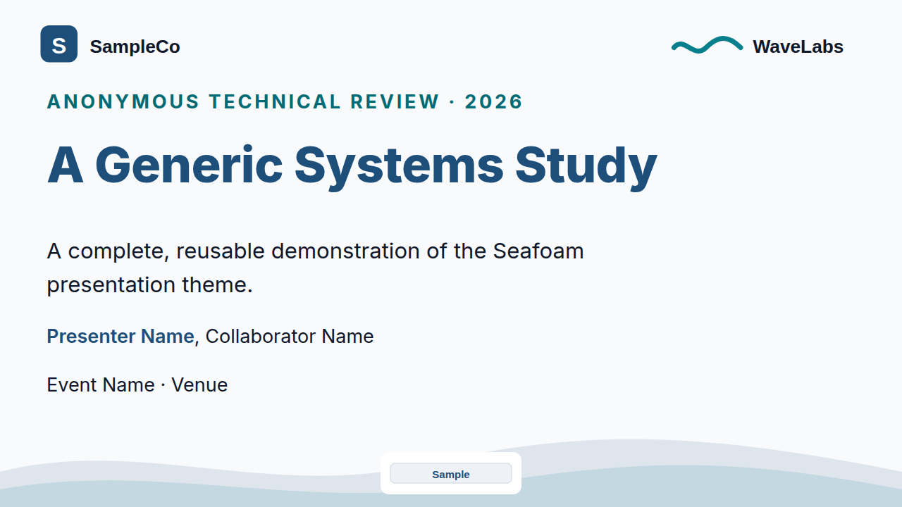
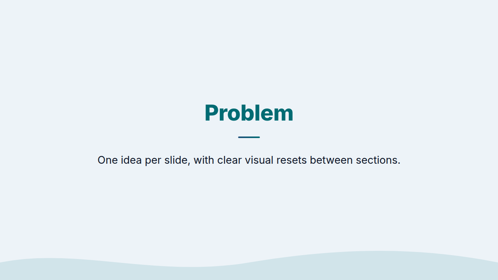
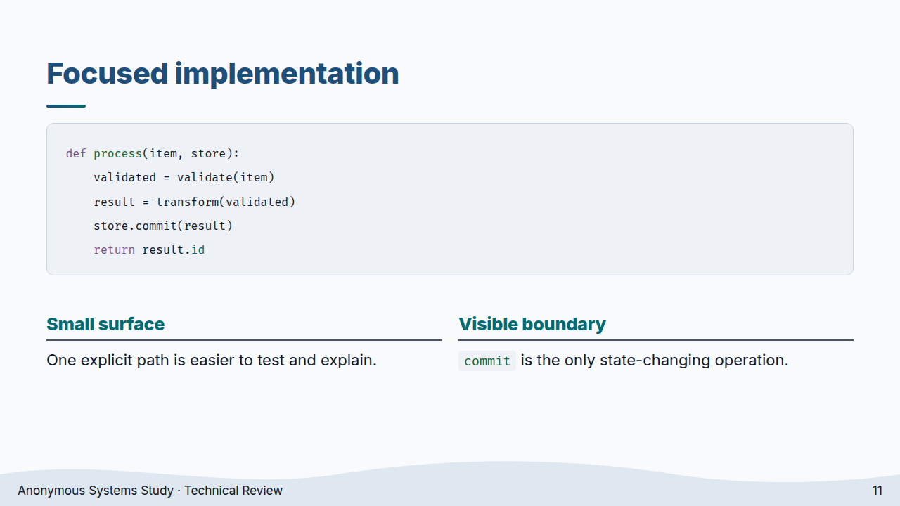
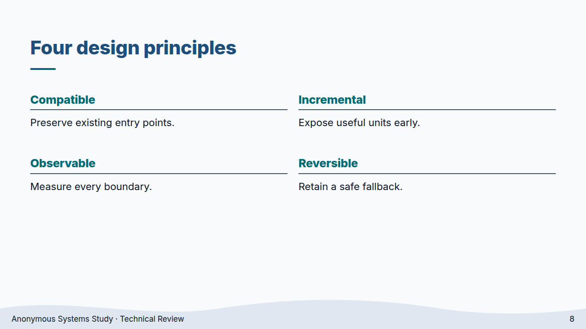
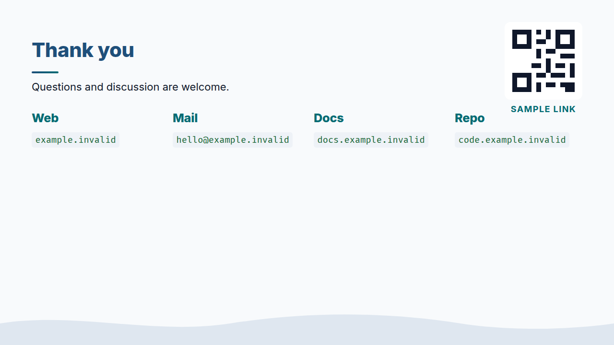

# Seafoam

A light [Marp](https://marp.app/) theme for technical presentations. Seafoam
combines a Dracula-inspired color system with soft wave motifs, structured
slide variants, figure layouts, process diagrams, and compact presentation
utilities.



**1280×720 · Marp CLI v4+ · HTML layouts · PDF-ready**

## Contents

- [Quick start](#quick-start)
- [Slide variants](#slide-variants)
- [Headers, footers, and logos](#headers-footers-and-logos)
- [Layouts](#layouts)
- [Components](#components)
- [Text and native elements](#text-and-native-elements)
- [Modifier reference](#modifier-reference)
- [Sample deck](#sample-deck)
- [Gallery](#gallery)
- [Palette](#palette)
- [Credits](#credits)

## Quick start

### Requirements

- [Marp CLI](https://github.com/marp-team/marp-cli) v4+ or Marp for VS Code.
- `html: true` when using the HTML components documented below. Plain Markdown,
  slide classes, tables, and fenced code do not require it.
- `--allow-local-files` when local images or SVGs are referenced.

Create `deck.md`:

```yaml
---
marp: true
theme: seafoam
html: true
paginate: true
---
```

Render it with the theme file:

```bash
npx @marp-team/marp-cli deck.md \
  --theme path/to/seafoam.css \
  --allow-local-files \
  --output deck.html
```

Use `--pdf` and a `.pdf` output path to build a PDF. Marp resolves
`theme: seafoam` from the `@theme` name inside `seafoam.css`; `--theme` tells
the CLI where that stylesheet lives.

> The wave artwork is embedded in the CSS. Inter is loaded from Google Fonts
> when available and falls back to system sans-serif fonts offline.

## Slide variants

Set a slide class with a local Marp directive:

```markdown
<!-- _class: lead title -->
```

| Class | Use |
|---|---|
| `lead` | Main title layout with a large heading and wave footer |
| `title` | Modifier for `lead` that moves large institution logos to the top |
| `section` | Centered section divider with a wave background |
| `invert` | Dark emphasis slide |
| `closing` | Closing layout for contacts and a QR panel |
| `compact` | 22px body text for dense technical slides |
| `sources` | 18px body text for references and assumptions |

Recommended title pattern:

```markdown
<!-- _class: lead title -->
<!-- _paginate: false -->
<!-- _footer: '' -->

<span class="eyebrow">Technical review · 2026</span>

# Presentation title

<p class="subtitle">One concise sentence that frames the deck.</p>

**Presenter Name**, Collaborator Name
```

Section dividers normally hide pagination and the footer:

```markdown
<!-- _class: section -->
<!-- _paginate: false -->
<!-- _footer: '' -->

# Evaluation
```

## Headers, footers, and logos

Marp supplies header, footer, and pagination elements. Seafoam positions and
styles them over the wave footer:

```yaml
---
header: Section label
footer: Anonymous Study · Technical Review
---
```

Use a direct HTML container for institution logos. Do not wrap it in a
`<header>` element: Marp reserves that element for its own header directive.

```html
<div class="institution-logos">
  
  
</div>
```

- `institution-logo` applies consistent sizing.
- `unito-logo` is an optional taller-logo modifier; despite the historical
  class name, it is not tied to a particular organization.
- On `lead`, the logo row sits at the bottom. Adding `title` moves larger logos
  to the top. On `closing`, the row also sits at the top.
- `center-logo` places one white-padded mark at bottom center, or at the top on
  `closing` slides.

```html

```

## Layouts

### Grids and cards

Always combine a column class with `grid`:

| Markup | Result |
|---|---|
| `grid cols-2` | Two equal columns |
| `grid cols-3` | Three equal columns |
| `grid cols-4` | Four cards arranged as a 2×2 grid |

```html
<div class="grid cols-3">
  <div class="card"><h3>First</h3><p>Short description.</p></div>
  <div class="card"><h3>Second</h3><p>Short description.</p></div>
  <div class="card"><div class="metric">42%</div><p>Key result</p></div>
</div>
```

`card` adds heading structure. `metric` creates a large display value and can
be used inside or outside a card.

### Figures

`paper-figure` constrains and frames an image. `figure-box` centers a figure;
`short` and `tall` change its maximum image height.

```html
<div class="figure-box tall">
  
  <div class="figure-caption">Synthetic comparison across four stages.</div>
</div>
```

| Variant | Maximum image height |
|---|---:|
| Default | 320px |
| `figure-box short` | 220px |
| `figure-box tall` | 400px |

`visual-split` expects exactly two direct `<div>` children: a figure panel,
then explanatory content. Add `narrow-image` for a fixed 550px figure column
and `top` to align both panels at the top.

```html
<div class="visual-split narrow-image top">
  <div></div>
  <div>
    <h3>Main result</h3>
    <p>Explain the result in one or two short paragraphs.</p>
  </div>
</div>
```

### Flow

Use `flow` with alternating `step` and `arrow` children:

```html
<div class="flow">
  <span class="step">Accept</span>
  <span class="arrow">→</span>
  <span class="step">Validate</span>
  <span class="arrow">→</span>
  <span class="step">Confirm</span>
</div>
```

### Timeline

The default timeline expects five stages. Use `timeline-3` or `timeline-4`
for exactly three or four stages.

```html
<div class="timeline timeline-3">
  <div class="timeline-item"><span class="timeline-marker">1</span><h3>Prototype</h3><p>Validate</p></div>
  <div class="timeline-item"><span class="timeline-marker">2</span><h3>Pilot</h3><p>Measure</p></div>
  <div class="timeline-item"><span class="timeline-marker">3</span><h3>Release</h3><p>Operate</p></div>
</div>
```

### Architecture

`architecture` is a fixed three-node pipeline. Use exactly three `box`
children separated by two `connector` elements.

```html
<div class="architecture">
  <div class="box"><strong>Producer</strong>Creates units</div>
  <span class="connector">→</span>
  <div class="box"><strong>Coordinator</strong>Routes units</div>
  <span class="connector">→</span>
  <div class="box"><strong>Consumer</strong>Uses units</div>
</div>
```

## Components

### Callouts

`warning` modifies `callout`; it is not a standalone component.

```html
<div class="callout">Main conclusion.</div>
<div class="callout warning">Important limitation.</div>
```

### Citation

```html
<div class="citation">
  <span class="citation-label">Reference</span>
  <code>example.invalid/specification</code>
</div>
```

### Badges

`badges` vertically stacks image elements carrying the `badge` class.

```html
<div class="badges">
  
  
</div>
```

### Fast statistics

Each statistic must be a `<p>` containing a `<strong>` value followed by a
`<span>` caption.

```html
<div class="fast-stats">
  <p><strong>2.8×</strong><span>illustrative peak rate</span></p>
  <p><strong>−61%</strong><span>illustrative latency</span></p>
</div>
```

### Reference range

The track requires three zones, a marker, and three matching labels. Set the
marker position inline per slide; 61% is the CSS default.

```html
<div class="reference-range">
  <div class="range-track">
    <span class="range-zone range-low"></span>
    <span class="range-zone range-normal"></span>
    <span class="range-zone range-high"></span>
    <span class="range-marker" style="left: 40%"></span>
  </div>
  <div class="range-labels"><span>Low</span><span>Expected</span><span>High</span></div>
</div>
```

The marker caption is the CSS-generated word `value`. Change
`.range-marker::before` in a custom theme override if a different caption is
required.

### Closing layout

`closing-grid-4` modifies `closing-grid` into four columns. Use four
`closing-contact` children. `qr-corner` positions a `qr-block` in the upper
right; `qr-code` applies scannable image treatment.

```markdown
<!-- _class: closing -->
<!-- _paginate: false -->
<!-- _footer: '' -->

# Thank you

<div class="closing-grid closing-grid-4">
  <div class="closing-contact"><h3>Web</h3><code>example.invalid</code></div>
  <div class="closing-contact"><h3>Mail</h3><code>hello@example.invalid</code></div>
  <div class="closing-contact"><h3>Docs</h3><code>docs.example.invalid</code></div>
  <div class="closing-contact"><h3>Repo</h3><code>code.example.invalid</code></div>
</div>

<div class="qr-corner">
  <div class="qr-block">
    
    Slides
  </div>
</div>
```

## Text and native elements

### Text utilities

| Class | Effect |
|---|---|
| `subtitle` | Wide subtitle, typically used on lead slides |
| `eyebrow` | Uppercase lead-slide label |
| `muted` | Secondary text color |
| `accent` | Cyan text |
| `green` | Success-colored text |
| `orange` | Caution-colored text |
| `small` | 76% font size |
| `tiny` | 62% font size |

### Markdown elements

Seafoam styles headings, links, lists, tables, inline code, fenced code,
images, `<blockquote>`, `<mark>`, and `<hr>` without additional classes.

```markdown
> A short quotation can reset the slide's pace.

Use <mark>highlighting</mark> sparingly and keep inline `code` short.

<hr>
```

### Syntax highlighting

Fenced code blocks use Marp's Highlight.js integration:

````markdown
```python
def process(item):
    return transform(item)
```
````

Common identifiers include `python`, `javascript`, `typescript`, `bash`,
`json`, `yaml`, and `cpp`.

## Modifier reference

Attach each modifier to its matching base component.

| Base | Modifier | Effect |
|---|---|---|
| `lead` | `title` | Large institution logos at the top |
| `institution-logo` | `unito-logo` | Taller logo variant |
| `grid` | `cols-2`, `cols-3`, `cols-4` | Column count/layout |
| `grid` | `tight-grid` | Reduced top margin and gaps |
| `figure-box` | `short`, `tall` | Image-height variant |
| `visual-split` | `narrow-image` | Fixed 550px figure column |
| `visual-split` | `top` | Top-aligned panels |
| `flow` | `tight-flow` | Reduced top margin |
| `timeline` | `timeline-3`, `timeline-4` | Three/four stages |
| `callout` | `warning` | Orange caution rule |
| `callout` | `tight-callout` | Compact spacing and type |
| `closing-grid` | `closing-grid-4` | Four contact columns |

## Sample deck

[`sample/deck.md`](sample/deck.md) is a 25-slide anonymous technical deck
that exercises every documented public component. All names, links, metrics,
and results are fictional; all assets are self-authored and local.

Build with the package scripts:

```bash
cd sample
npm install
npm run html
npm run pdf   # requires Chrome/Chromium
```

Or run Marp directly:

```bash
cd sample
npx @marp-team/marp-cli deck.md \
  --theme ../seafoam.css \
  --allow-local-files \
  --output deck.html
```

See [`sample/README.md`](sample/README.md) for the sample-specific guide.

## Gallery

| Title | Section divider |
|---|---|
|  |  |
| **Focused code** | **Four-card grid** |
|  |  |

### Closing



## Palette

Seafoam preserves Dracula's semantic color roles while increasing contrast on
the light `#f8fafc` background.

| Role | Dracula | Seafoam |
|---|---|---|
| Background | `#282a36` | `#f8fafc` |
| Background alt | `#21222c` | `#eef2f7` |
| Current line | `#44475a` | `#cbd5e1` |
| Foreground | `#f8f8f2` | `#0f172a` |
| Comment | `#6272a4` | `#475569` |
| Cyan | `#8be9fd` | `#006b73` |
| Green | `#50fa7b` | `#166534` |
| Orange | `#ffb86c` | `#92400e` |
| Pink | `#ff79c6` | `#8f3657` |
| Purple | `#bd93f9` | `#1e4f7a` |
| Red | `#ff5555` | `#b42318` |
| Yellow | `#f1fa8c` | `#654d00` |

## Credits

Seafoam is adapted from established open-source Marp themes:

- Palette, typography, Highlight.js colors, and theme conventions:
  [Dracula Marp](https://github.com/dracula/marp) by Daniel Gisolfi.
- Wave motifs and code/column inspiration:
  [MarpThemeWave](https://github.com/JuliusWiedemann/MarpThemeWave) by Julius
  Wiedemann.
- Presentation engine: [Marp](https://marp.app/) and
  [Marpit](https://github.com/marp-team/marpit).

## License

MIT. See [`LICENSE`](LICENSE).
