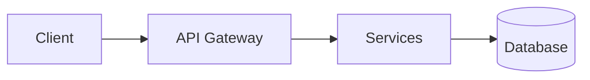
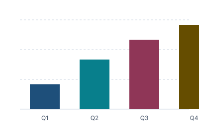

<!-- _class: lead -->

<span class="eyebrow">Engineering review · Q3</span>

# Seafoam Systems

### A light deck for the Dracula Waves theme

<span class="subtitle">Rendering every utility, layout, and slide class in the theme.</span>

<!-- _footer: Seafoam Systems · Engineering Review -->

---

<!-- _class: title -->

<header class="institution-logos">


</header>

# Logos

Institution marks live in a `<header class="institution-logos">`; the `title`
slide class pins them to the top. The samples above are self-authored marks so
nothing is copied — swap in any permissively-licensed logo (Python's PSF
mark, Marp's MIT mark, …).

> Keep marks on a white chip so they read against the light palette.

---

## Agenda

1. Architecture overview
2. Performance numbers
3. Roadmap & timeline
4. Closing

---

<!-- _class: section -->

# Architecture

---

## System overview



> A request flows from the client through the gateway into the services layer,
> with the database as the single source of truth.

<div class="callout">

**Callout** — a highlighted aside with an accent rule on the left.

</div>

<div class="warning">

**Warning** — a caution band for things that deserve a second look.

</div>

---

## Architecture

<div class="architecture">

<div class="architecture-box">Client</div>
<span class="architecture-connector">→</span>
<div class="architecture-box">Gateway</div>
<span class="architecture-connector">→</span>
<div class="architecture-box">Services</div>

</div>

---

## Layouts

<figure class="figure-box">



<figcaption class="figure-caption">Quarterly totals, `figure-box` short variant.</figcaption>

</figure>

<div class="visual-split">

**Left** — text beside a figure or chart.

**Right** — the visual, kept in its own lane.

</div>

<div class="reference-range">

<span class="range-track">

<span class="range-labels">low / normal / high</span>
<span class="range-zone" style="left: 8%; width: 46%;">target</span>
<span class="range-marker" style="left: 78%;"></span>

</span>

</div>

---

## Utilities

<span class="accent">accent</span> · <span class="green">green</span> · <span class="orange">orange</span> · <span class="small">small</span> · <span class="tiny">tiny</span> · <span class="muted">muted</span>

A sentence with a <span class="citation">citation</span> and a **`mark`** highlight, plus an `<hr>`:

<div class="badges">

<span class="badge">badge</span> <span class="badge">badge</span> <span class="badge">badge</span>

</div>

<hr>

<blockquote>Blockquote — pull a quote out of the flow.</blockquote>

---

## Code sample

```python
from seafoam import pipeline

def ingest(raw: bytes) -> int:
    rows = pipeline.decode(raw)      # strings → pink, numbers → purple
    return pipeline.store(rows)      # titles → green
```

Inline `code` and `--muted--` text sit on the light palette.

A <span class="mark">highlighted mark</span> and an `<hr>` divider:

<hr>

---

## Throughput by region

| Region | RPS | Latency (ms) | Status |
|---|---|---|---|
| eu-west | 1 200 | 38 | ✅ |
| us-east | 1 800 | 24 | ✅ |
| ap-south | 640 | 61 | ⚠️ |

<div class="grid cols-2 tight-grid">

<div class="metric">

**1 800 RPS**

<small>peak throughput, us-east</small>

</div>

<div class="metric">

**38 ms**

<small>median latency, eu-west</small>

</div>

</div>

---

## Two-column grid

<div class="grid cols-2">

<div>

### Column A

- Feature one
- Feature two
- Feature three

</div>

<div>

### Column B

- Item four
- Item five
- Item six

</div>

</div>

---

## Timeline

<div class="timeline timeline-3">

<div class="timeline-item">

<span class="timeline-marker"></span>

**Q1** — Foundation

</div>

<div class="timeline-item">

<span class="timeline-marker"></span>

**Q2** — Public beta

</div>

<div class="timeline-item">

<span class="timeline-marker"></span>

**Q3** — GA

</div>

</div>

---

## Fast stats

<div class="fast-stats">

- **99.9%** uptime
- **< 50 ms** p95 latency
- **1.2 M** events / day

</div>

---

## Flow

<div class="flow">

<span class="step">Ingest</span> <span class="arrow">→</span>
<span class="step">Transform</span> <span class="arrow">→</span>
<span class="step">Serve</span>

</div>

---

<!-- _class: invert -->

## Invert slide

Emphasis flips: dark background, light text, for contrast moments.

---

## Closing

<div class="closing-grid closing-grid-4">

- **Web** seafoam.example
- **Mail** hello@seafoam.example
- **Docs** docs.seafoam.example
- **Repo** github.com/seafoam

</div>

---

<!-- _class: closing -->

# Thank you

Questions & discussion welcome.
